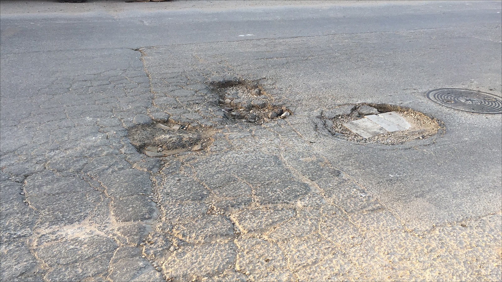
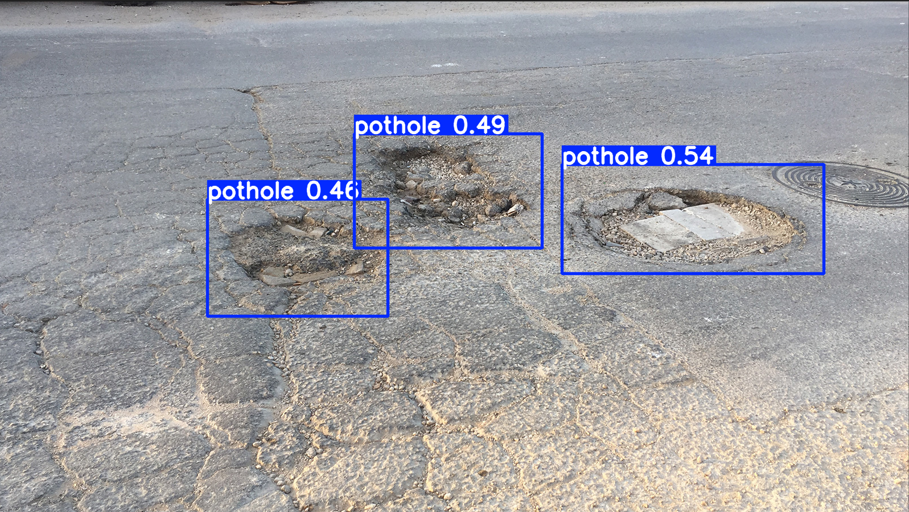

# 🕳️ Pothole Detector using YOLOv8

This project is a **computer vision model** that detects potholes in road images and videos.  
It was built using [YOLOv8](https://github.com/ultralytics/ultralytics), trained on a custom dataset.

---

## 🚀 Features
- Detects potholes in images and videos with bounding boxes.
- Works with live camera feeds using **OpenCV**.
- Fine-tuned **YOLOv8** model on a pothole dataset.  
## 📊 Results

| Original Image | Detection Result |
|----------------|------------------|
|  |  |
